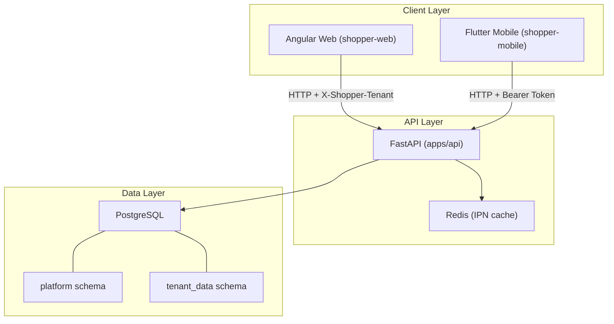
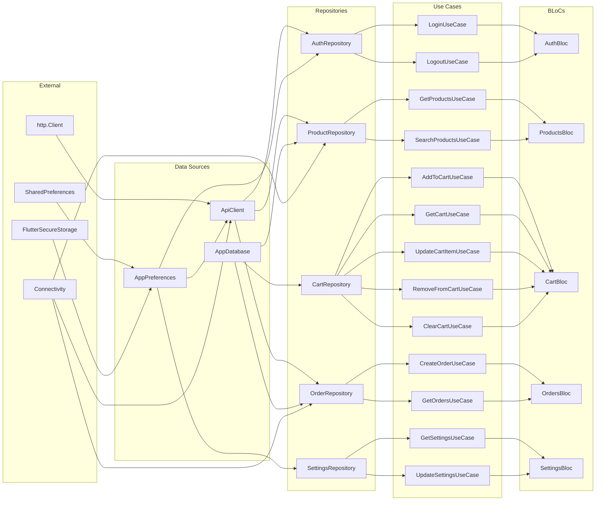

# Shopper Platform — Architecture Map

> **Last Updated:** 2026-04-20
> **Rule:** Always update this map as the last step of any structural change.

---

## Table of Contents

1. [High-Level Architecture](#1-high-level-architecture)
2. [API Service (Python / FastAPI)](#2-api-service)
3. [Web Frontend (Angular 17+)](#3-web-frontend)
    - [3.1 App Layout & Routing](#31-app-layout--routing)
    - [3.2 Core Services & Interceptors](#32-core-services--interceptors)
    - [3.3 Feature Components (UI Layer)](#33-feature-components-ui-layer)
4. [Mobile App (Flutter / Dart)](#4-mobile-app)
    - [4.1 Domain Entities](#41-domain-entities)
    - [4.2 Domain Repositories](#42-domain-repositories)
    - [4.3 Domain Use Cases](#43-domain-use-cases)
    - [4.4 BLoC Layer (State Management)](#44-bloc-layer-state-management)
    - [4.5 Data Layer (Sources & Repositories)](#45-data-layer-sources--repositories)
    - [4.6 Presentation Layer (Screens & Demo)](#46-presentation-layer-screens--demo)
    - [4.7 Global UI Widgets](#47-global-ui-widgets)
    - [4.8 Data Display & List Widgets](#48-data-display--list-widgets)
    - [4.9 Layout & Spacer Widgets](#49-layout--spacer-widgets)
5. [Database Schema (PostgreSQL)](#5-database-schema)
6. [Test Suites](#6-test-suites)
7. [Dependency Injection Maps](#7-dependency-injection-maps)
8. [Cross-Service Dependency Matrix](#8-cross-service-dependency-matrix)
9. [Form Controls Inventory](#9-form-controls-inventory)
10. [UI Layer File Inventory](#10-ui-layer-file-inventory)

---

## 1. High-Level Architecture



### Tech Stack Summary

| API | Python 3.11+, FastAPI, asyncpg, Pydantic v2 | `apps/api/` |
| Web FE | Angular 17+, TypeScript, Transloco i18n | `apps/shopper-web/` |
| Mobile | Flutter/Dart, BLoC, Drift (SQLite), GetIt DI | `shopper-mobile/` |
| Database | PostgreSQL 15+, RLS, uuid-ossp, citext | `database/` |
| Cache | Redis (async, optional) | via `redis_client.py` |
| Infra | Docker Compose, OpenResty | `infra/`, `docker-compose.yml` |

---

## 2. API Service

**Root:** `apps/api/`

### 2.1 Configuration

#### `config.py` — class `Settings(BaseSettings)`
| Property | Type | Default | Description |
|----------|------|---------|-------------|
| `testing` | `bool` | `False` | Test mode flag |
| `integration_test` | `bool` | `False` | Integration test flag |
| `database_url` | `str` | `postgresql://...` | App DB connection |
| `migrate_database_url` | `str \| None` | `None` | Migrate-role DB connection |
| `platform_root_domain` | `str \| None` | `None` | Multi-tenant domain root |
| `storefront_public_base_url` | `str \| None` | `None` | QR code base URL |
| `cors_allow_origins` | `str` | `"*"` | CORS origins CSV |
| `shopper_admin_api_key` | `str \| None` | `None` | Platform admin API key |
| `redis_url` | `str \| None` | `"redis://redis:6379/0"` | Redis connection |
| `redis_ipn_ttl_seconds` | `int` | `86400` | IPN replay suppression TTL |
| `sslcommerz_store_id` | `str \| None` | `None` | SSLCommerz store ID |
| `sslcommerz_store_password` | `str \| None` | `None` | SSLCommerz password |

**Methods:**
- `empty_str_to_none(v)` — field validator
- `cors_origins_list() -> list[str]` — parse CORS origins
- `normalize_dsn(dsn) -> str` — strip `+asyncpg` suffix

**Functions:**
- `get_settings() -> Settings` — cached singleton
- `clear_settings_cache() -> None` — bust cache (tests)

---

### 2.2 Pydantic Schemas (`schemas.py`)

| Schema | Extends | Key Fields | Used By |
|--------|---------|------------|---------|
| `ProductBase` | `BaseModel` | `sku`, `name_en`, `name_bn`, `unit`, `buy_price`, `sell_price`, `mrp`, `vat_rate_pct`, `category_id` | Create |
| `ProductCreate` | `ProductBase` | *(inherits all)* | `POST /products` |
| `ProductUpdate` | `BaseModel` | all optional: `name_en/bn`, `unit`, prices, `is_active` | `PATCH /products/{id}` |
| `ProductOut` | `BaseModel` | `id`, `tenant_id` + all product fields + `barcode`, `qr_payload`, timestamps | Response |
| `CustomerBase` | `BaseModel` | `code`, `name_en/bn`, `phone`, `email`, `billing_address_en/bn` | Create |
| `CustomerCreate` | `CustomerBase` | *(inherits all)* | `POST /customers` |
| `CustomerUpdate` | `BaseModel` | all optional customer fields | Update |
| `CustomerOut` | `BaseModel` | `id`, `tenant_id` + customer fields + `created_at` | Response |
| `TenantSettingsOut` | `BaseModel` | `tenant_id`, `theme_id`, `default_language`, `logo_url`, `legal_title_en/bn`, `bin`, `default_vat_rate_pct`, `module_access`, timestamps | Response |
| `PaymentCreate` | `BaseModel` | `gateway` (enum), `amount`, `currency`, `description`, `order_id` | `POST /payments` |
| `PaymentOut` | `BaseModel` | `id`, `gateway`, `amount`, `currency`, `status`, `gateway_transaction_id`, timestamps | Response |
| `InvoiceOut` | `BaseModel` | `id`, `invoice_no`, `buyer_tin`, `grand_total`, `balance_due`, `status` | Response |
| `InvoiceLineOut` | `BaseModel` | `id`, `description`, `qty`, `unit_price`, `vat_rate_pct`, `line_vat` | Response |
| `StockValuationOut` | `BaseModel` | `sku`, `name_en`, `qty`, `wac_cost`, `total_valuation` | Report |
| `VATRegisterOut` | `BaseModel` | `mushak_form`, `invoice_no`, `taxable_value`, `vat_amount` | Report |
| `BusinessAnalyticsOut` | `BaseModel` | `itr`, `eoq_recommendations[]` | Report |
| `StorefrontProductOut` | `BaseModel` | `id`, `sku`, `name_en/bn`, prices (no `buy_price`), `barcode`, `qr_payload` | Public catalog |
| `StorefrontProductListResponse` | `BaseModel` | `tenant`, `products[]`, `total` | Response |
| `InventoryAgingItem` | `BaseModel` | `sku`, `name_en/bn`, `unit`, `sell_price`, `reference_date`, `days_idle`, `bucket` | Report |
| `InventoryAgingReportOut` | `BaseModel` | `as_of`, `items[]`, `summary{}` | Response |

**Enums:**
- `PaymentGateway` — `sslcommerz`, `bkash`, `nagad`, `rocket`
- `InventoryAgingBucket` — `"0_30"`, `"31_60"`, `"61_90"`, `"90_plus"` (Literal)

---

### 2.3 Routers (API Endpoints)

#### `products_router.py` — prefix `/v1/tenant/products`
| Method | Path | Function | Deps |
|--------|------|----------|------|
| `GET` | `` | `list_products` | `tenant`, `schemas` |
| `GET` | `/{product_id}` | `get_product` | `tenant`, `schemas` |
| `POST` | `` | `create_product` | `tenant`, `schemas`, `codes`, `deps` |
| `PATCH` | `/{product_id}` | `update_product` | `tenant`, `schemas` |
| `DELETE` | `/{product_id}` | `delete_product` | `tenant` |

**Helper:** `_row_to_out(row) -> ProductOut`

#### `customers_router.py` — prefix `/v1/tenant/customers`
| Method | Path | Function |
|--------|------|----------|
| `GET` | `` | `list_customers` |
| `POST` | `` | `create_customer` |

#### `payments_router.py` — prefix `/v1/tenant/payments`
| Method | Path | Function | Notes |
|--------|------|----------|-------|
| `POST` | `` | `create_payment` | initiate gateway + insert pending |
| `POST` | `/ipn/{gateway}` | `handle_ipn` | IPN webhook (form + JSON) |

**Classes:**
- `PaymentGatewayInterface(ABC)` — methods: `initiate_payment()`, `verify_ipn()`, `ipn_payment_status()`
- `SSLCommerzGateway(PaymentGatewayInterface)` — props: `store_id`, `store_password`

**Helpers:** `_get_gateway()`, `_decimal_or_none()`, `_ipn_payload_dict()`, `_ipn_refs()`

#### `settings_router.py` — prefix `/v1/tenant/settings`
| Method | Path | Function |
|--------|------|----------|
| `GET` | `` | `get_tenant_settings` |

#### `storefront_router.py` — prefix `/v1/storefront`
| Method | Path | Function | Query Params |
|--------|------|----------|------|
| `GET` | `/products` | `storefront_products` | `q`, `limit`, `offset` |

#### `reports_router.py` — prefix `/v1/tenant/reports`
| Method | Path | Function |
|--------|------|----------|
| `GET` | `/inventory-aging` | `inventory_aging_report` |
| `GET` | `/stock-valuation` | `stock_valuation_report` |
| `GET` | `/vat-register` | `vat_register_report` |
| `GET` | `/vat-register/export/excel` | `vat_register_excel_export` |
| `GET` | `/business-analytics` | `business_analytics_report` |
| `GET` | `/mushak-6-10` | `mushak_6_10_report` |
| `GET` | `/mushak-6-1` | `mushak_6_1_report` |

#### `inventory_router.py` — prefix `/v1/tenant/inventory`
| Method | Path | Function | Description |
|--------|------|----------|-------------|
| `POST` | `/receive` | `stock_receive` | Increase stock (gift/purchase) |
| `POST` | `/adjust` | `stock_adjust` | Decrease stock (damage/return) |
| `POST` | `/transfer` | `create_stock_transfer` | recorded in `stock_transactions` |
| `GET` | `/history` | `get_inventory_history` | Audit trail of all movements |
| `GET` | `/transfer/{tx_id}/mushak-6-5` | `get_mushak_6_5_pdf` | Mushak 6.5 Stock Transfer PDF |

#### `procurement_router.py` — prefix `/v1/tenant/procurement`
| Method | Path | Function | Description |
|--------|------|----------|-------------|
| `POST` | `/po` | `create_purchase_order` | Draft PO |
| `POST` | `/po/{id}/receive` | `receive_po` | Finalize + Inventory Update |
| `POST` | `/payments` | `record_supplier_payment` | AP Tracking |
| `POST` | `/returns` | `create_purchase_return` | Mushak 6.8 (Debit Note) |

#### `admin_router.py` — prefix `/v1/admin`
| Method | Path | Function | Auth |
|--------|------|----------|------|
| `GET` | `/tenants` | `list_tenants` | `X-Shopper-Admin-Key` |
| `PATCH` | `/tenants/{id}/status` | `set_tenant_status` | `X-Shopper-Admin-Key` |
| `POST` | `/tenants/provision-db` | `provision_dedicated_db` | `X-Shopper-Admin-Key` |
| `POST` | `/tenants/migrate` | `migrate_tenant` | `X-Shopper-Admin-Key` |
| `GET` | `/tenants/{id}/export` | `export_tenant_data` | `X-Shopper-Admin-Key` |

#### `registration_router.py` — prefix `/v1/register`
| Method | Path | Function | Description |
|--------|------|----------|-------------|
| `POST` | `` | `register_tenant` | Self-service onboarding |

#### `suppliers_router.py` — prefix `/v1/tenant/suppliers`
| Method | Path | Function |
|--------|------|----------|
| `GET`  | `` | `list_suppliers` |
| `POST` | `` | `create_supplier` |

#### `staff_router.py` — prefix `/v1/tenant/staff`
| Method | Path | Function |
|--------|------|----------|
| `GET`  | `` | `list_staff` |
| `POST` | `` | `create_staff` |

#### `expenses_router.py` — prefix `/v1/tenant/expenses`
| Method | Path | Function |
|--------|------|----------|
| `GET`  | `/categories` | `list_categories` |
| `POST` | `` | `create_expense` |

#### `accounts_router.py` — prefix `/v1/tenant/accounts`
| Method | Path | Function | Description |
|--------|------|----------|-------------|
| `GET`  | `` | `list_accounts` | COA View |
| `POST` | `/transfer` | `transfer_funds` | Double-entry journal |

#### `maintenance_router.py` — prefix `/v1/tenant/maintenance`
| Method | Path | Function | Description |
|--------|------|----------|-------------|
| `POST` | `/ledger-reconcile` | `reconcile_ledger_balances` | Self-healing account balances |
| `GET`  | `/health` | `health_check` | Deep connectivity verify |

### 🕒 Mobile Synchronization Architecture
The mobile app operates on an **Offline-First** principle with an **ACK-First** sync pattern.
- **Local DB**: Drift (SQLite) with schema version 4.
- **Sync Model**:
  - **Orders**: Atomic local stock deduction followed by `offline-punch` API call.
  - **Stock Adjustments**: Unsynced changes in `stock_adjustments` table are batch-processed via `SyncAdjustmentsUseCase`.
- **Conflict Resolution**: Last-write-wins with server timestamp override.

### 📦 Component Mapping

#### `invoices_router.py` — prefix `/v1/tenant/invoices`
| Method | Path | Function |
|--------|------|----------|
| `GET` | `` | `list_invoices` |
| `GET` | `/{id}` | `get_invoice` |
| `POST` | `` | `create_invoice` |

#### `receipt_router.py` — prefix `/v1/tenant/receipts`
| Method | Path | Function | Notes |
|--------|------|----------|-------|
| `GET` | `/{id}/pdf` | `generate_mushak_6_3` | Bilingual Mushak 6.3 PDF |
| `GET` | `/{id}/thermal`| `generate_thermal` | ESC/POS Thermal Receipt |

**Request Bodies:**
- `TenantStatusBody` — `status: Literal["pending","active","suspended","deleted","trialing","past_due","canceled"]`
- `ProvisionDedicatedDBBody` — `tenant_id: UUID`, `database_name: str`

---

### 2.4 Core Modules

#### `tenant.py`
| Function | Signature | Description |
|----------|-----------|-------------|
| `subdomain_from_request` | `(Request) -> str \| None` | Reads `X-Shopper-Tenant` header or host |
| `resolve_tenant_id` | `(Pool, str) -> UUID` | SQL lookup `platform.tenants` |
| `tenant_transaction` | `(Pool, UUID) -> AsyncContextManager[Connection]` | Sets `app.tenant_id` GUC |

#### `host_tenant.py`
| Function | Signature |
|----------|-----------|
| `subdomain_from_host` | `(host, platform_root_domain) -> str \| None` |

#### `codes.py`
| Function | Signature | Description |
|----------|-----------|-------------|
| `barcode_for_sku` | `(sku) -> str` | Code128-friendly barcode |
| `qr_payload_for_product` | `(base, subdomain, sku) -> str` | Storefront URL |

#### `deps.py`
| Type | Name |
|------|------|
| `SettingsDep` | `Annotated[Settings, Depends(configure_settings)]` |

#### `redis_client.py`
| Function | Description |
|----------|-------------|
| `build_ipn_idempotency_key` | Generates `shopper:ipn:v1:{sub}:{gw}:{ref}` |
| `connect_redis` | Async connect with ping |
| `close_redis` | Graceful close |
| `ipn_already_processed` | Check replay suppression key |
| `ipn_record_processed` | Set replay suppression key with TTL |

#### `main.py`
| Symbol | Description |
|--------|-------------|
| `RequestContextFilter` | Logging filter: `tenant_id`, `trace_id` context vars |
| `lifespan()` | App startup/shutdown: pools + Redis |
| `tenant_context()` | HTTP middleware: resolve subdomain, set context vars |
| `app` | FastAPI instance with all routers |

---

## 3. Web Frontend

**Root:** `apps/shopper-web/src/app/`

### 3.1 App Layout & Routing

| File | Component / Class | Description |
|------|---------|-------------|
| `app.component.ts` | `AppComponent` | Root shell with language selector (`setLang`) |
| `app.component.html` | Template | Main layout, `<router-outlet>`, navigation links |
| `app.component.scss` | Styles | Global root styles |
| `app.config.ts` | Config | Providers: `provideRouter`, `provideHttpClient`, `provideTransloco` |
| `app.routes.ts` | `routes` | Path mapping: `/`, `/products`, `/admin/tenants` |

### 3.2 Core Services & Interceptors

#### Internationalization (`core/i18n/`)
| File | Class | Purpose |
|------|-------|---------|
| `locale.service.ts` | `LocaleService` | BDT formatting, language hydration, text direction |

#### Multi-Tenancy (`core/tenant/`)
| File | Class / Fn | Purpose |
|------|-------|---------|
| `tenant-settings.service.ts` | `TenantSettingsService` | Fetch tenant-specific theme, logo, and VAT config |
| `theme.service.ts` | `ThemeService` | Manage 10+ dynamic themes via CSS variables |
| `tenant-bootstrap.ts` | `tenantBootstrap` | App init: set `data-theme` and default language |

#### Networking (`core/http/`)
| File | Function | Header Injection |
|------|----------|-----------------|
| `shopper-admin.interceptor.ts` | `shopperAdminInterceptor` | `X-Shopper-Admin-Key` (session) |
| `shopper-tenant.interceptor.ts` | `shopperTenantInterceptor` | `X-Shopper-Tenant` (env/host) |

#### Shared Components (`shared/components/`)
| File | Component | Purpose |
|------|-----------|---------|
| `shopper-button.component.ts` | `ShopperButtonComponent` | Reusable button with variants |
| `shopper-data-grid.component.ts`| `ShopperDataGridComponent` | Reusable data table with sorting/pagination |

### 3.3 Feature Components (UI Layer)

#### Products Feature (`features/products/`)
| File | Component / Service | Purpose |
|------|---|---|
| `products-page.component.ts` | `ProductsPageComponent` | Manage product list state and creation form |
| `products-page.component.html` | Template | Grid form (SKU, Name, Price, VAT) + Product Table |
| `product.service.ts` | `ProductService` | CRUD API wrapper for products |

#### Admin Feature (`features/admin/`)
| File | Component / Service | Purpose |
|------|---|---|
| `admin-tenants.component.ts` | `AdminTenantsComponent` | Platform-level tenant status management |
| `admin-tenants.component.html` | Template | Admin key input field + Tenant list with status dropdowns |
| `admin-platform.service.ts` | `AdminPlatformService` | Admin-only platform API wrapper |

#### Home Feature (`features/home/`)
| File | Component | Purpose |
|------|---|---|
| `home.component.ts` | `HomeComponent` | Static landing page shell |
| `home.component.html` | Template | Public landing content |

#### Invoices Feature (`features/invoices/`)
| File | Component | Purpose |
|------|-----------|---------|
| `invoices-page.component.ts` | `InvoicesPageComponent` | Sales ledger and Mushak 6.3 preview |

#### Procurement Feature (`features/procurement/`)
| File | Component | Purpose |
|------|-----------|---------|
| `procurement-page.component.ts` | `ProcurementPageComponent` | PO Lifecycle and Debit Notes |

#### Inventory Feature (`features/inventory/`)
| File | Component | Purpose |
|------|-----------|---------|
| `inventory-page.component.ts` | `InventoryPageComponent` | Non-monetary stock audit log |

### 3.4 Mobile POS UI (Flutter)
| Path | Component / Screen | Purpose |
|------|-----------|---------|
| `screens/home_screen.dart` | `HomeScreen` | Activity dashboard & quick actions |
| `screens/products_screen.dart`| `ProductsScreen`| Searchable product catalog |
| `screens/cart_screen.dart` | `CartScreen` | Subtotal & adjustment view |
| `screens/checkout_screen.dart`| `CheckoutScreen`| Multi-payment and Credit completion |
| `screens/inventory_screen.dart`| `InventoryScreen`| Manual stock adjustments (Damaged, Gift) |
| `screens/daily_sales_register_screen.dart`| `DailySalesRegisterScreen`| Offline-to-Online transaction audit |
| `screens/reports_screen.dart` | `ReportsScreen` | Analytics dashboard shell |
| `screens/settings_screen.dart`| `SettingsScreen`| Configuration & Language toggle |

### 3.3 HTTP Interceptors

| File | Name | Trigger | Header |
|------|------|---------|--------|
| `shopper-admin.interceptor.ts` | `shopperAdminInterceptor` | URL contains `/v1/admin` | `X-Shopper-Admin-Key` from sessionStorage |
| `shopper-tenant.interceptor.ts` | `shopperTenantInterceptor` | All requests | `X-Shopper-Tenant` from env `devTenantSubdomain` |

**Constant:** `SHOPPER_ADMIN_KEY_STORAGE = 'shopper.adminKey'`

### 3.4 Feature Components

#### `features/products/product.service.ts` — `ProductService`
| Method | Return | Endpoint |
|--------|--------|----------|
| `list()` | `Observable<Product[]>` | `GET /v1/tenant/products` |
| `create(body)` | `Observable<Product>` | `POST /v1/tenant/products` |
| `deactivate(id)` | `Observable<void>` | `DELETE /v1/tenant/products/{id}` |

**Interfaces:**
- `Product` — `id`, `tenant_id`, `category_id`, `sku`, `name_en/bn`, `description_en/bn`, `unit`, `buy_price`, `sell_price`, `mrp`, `vat_rate_pct`, `barcode`, `qr_payload`, `is_active`, timestamps
- `ProductCreateBody` — `sku`, `name_en`, `name_bn`, optional: `unit`, `sell_price`, `vat_rate_pct`

#### `features/products/products-page.component.ts` — `ProductsPageComponent`
| Signal / Property | Type | Description |
|---|---|---|
| `items` | `Signal<Product[]>` | Product list |
| `loadError` | `Signal<string \| null>` | Error key |
| `saving` | `Signal<boolean>` | Submit in-progress |
| `formError` | `Signal<string \| null>` | Form error key |
| `sku`, `nameEn`, `nameBn` | `string` | Form inputs |
| `sellPrice` | `number \| null` | Form input |
| `vatRate` | `number` | Form input (default 0) |

| Method | Description |
|--------|-------------|
| `reload()` | Fetch products |
| `labelName(p)` | Bilingual name |
| `submit()` | Validate + create product |
| `deactivate(p)` | Confirm + soft-delete |

#### `features/admin/admin-platform.service.ts` — `AdminPlatformService`
| Method | Return | Endpoint |
|--------|--------|----------|
| `listTenants()` | `Observable<PlatformTenantRow[]>` | `GET /v1/admin/tenants` |
| `setTenantStatus(id, status)` | `Observable<PlatformTenantRow>` | `PATCH /v1/admin/tenants/{id}/status` |

**Interfaces/Types:**
- `PlatformTenantRow` — `id`, `subdomain`, `display_name_en/bn`, `status`, `dedicated_database_name`, timestamps
- `TenantLifecycleStatus` — `'pending' | 'active' | 'suspended' | 'deleted'`

#### `features/admin/admin-tenants.component.ts` — `AdminTenantsComponent`
| Signal / Property | Type |
|---|---|
| `items` | `Signal<PlatformTenantRow[]>` |
| `loadError` | `Signal<string \| null>` |
| `keySaved` | `Signal<boolean>` |
| `savingId` | `Signal<string \| null>` |
| `adminKeyInput` | `string` |

| Method | Description |
|--------|-------------|
| `saveKey()` | Store admin key in sessionStorage |
| `clearKey()` | Remove admin key |
| `reload()` | Fetch tenants |
| `statuses()` | Return all lifecycle statuses |
| `onStatusChange(row, status)` | Update tenant status via API |

#### `features/home/home.component.ts` — `HomeComponent`
- Simple landing page component

---

## 4. Mobile App

**Root:** `shopper-mobile/lib/`

### 4.1 Domain Entities

#### `domain/entities/product.dart`

**class `Product` extends `Equatable`**
| Property | Type | Description |
|----------|------|-------------|
| `id` | `String` | Product ID |
| `name` | `String` | Product name |
| `description` | `String?` | |
| `barcode` | `String?` | |
| `sku` | `String?` | |
| `price` | `double` | Base selling price |
| `costPrice` | `double?` | Purchase cost |
| `sellPrice` | `double?` | Promotional price |
| `category` | `String?` | |
| `brand` | `String?` | |
| `imageUrl` | `String?` | Main image |
| `stockQuantity` | `int` | |
| `minStockLevel` | `int?` | |
| `isActive` | `bool` | |
| `isTaxable` | `bool` | |
| `taxRate` | `double?` | |
| `unit` | `String?` | |
| `color` | `String?` | |
| `size` | `String?` | |
| `attributes` | `Map<String, dynamic>?` | Flexible key-value |
| `specifications` | `Map<String, dynamic>?` | Technical specs |
| `images` | `List<String>?` | Additional images |
| `variants` | `List<ProductVariant>?` | |
| `createdAt` | `DateTime` | |
| `updatedAt` | `DateTime` | |

| Getter / Method | Return |
|---|---|
| `effectivePrice` | `double` — sellPrice ?? price |
| `discountAmount` | `double?` |
| `discountPercentage` | `double?` |
| `allImages` | `List<String>` |
| `formattedAttributes` | `String` |
| `hasAttribute(key)` | `bool` |
| `getAttribute(key)` | `dynamic` |
| `hasVariants` | `bool` |
| `getVariantsByAttribute(key, value)` | `List<ProductVariant>` |
| `isLowStock` | `bool` |
| `isOutOfStock` | `bool` |
| `validate()` | `ValidationResult` |

**Factory constructors:** `Product.clothing(...)`, `Product.electronics(...)`, `Product.food(...)`

---

**class `ProductCategory` extends `Equatable`**
| Property | Type |
|----------|------|
| `id`, `name` | `String` |
| `description`, `imageUrl` | `String?` |
| `isActive` | `bool` |
| `createdAt` | `DateTime` |

Methods: `validate()`

---

**class `ProductVariant` extends `Equatable`**
| Property | Type |
|----------|------|
| `id`, `productId` | `String` |
| `sku`, `barcode`, `imageUrl` | `String?` |
| `attributes` | `Map<String, String>` |
| `priceModifier` | `double?` |
| `stockQuantity` | `int` |
| `isActive` | `bool` |
| `createdAt`, `updatedAt` | `DateTime` |

Methods: `displayName` (getter), `getEffectivePrice(basePrice)`, `validate()`

---

#### `domain/entities/user.dart`

**class `User` extends `Equatable`**
| Property | Type |
|----------|------|
| `id`, `email`, `name`, `role` | `String` |
| `phone` | `String?` |
| `isActive` | `bool` |
| `createdAt`, `updatedAt` | `DateTime` |

Methods: `validate()`  
Allowed roles: `admin`, `manager`, `cashier`, `staff`

**class `AuthToken` extends `Equatable`**
| Property | Type |
|----------|------|
| `accessToken`, `refreshToken`, `tokenType` | `String` |
| `expiresAt` | `DateTime` |

Getters: `isExpired`  
Methods: `validate()`

---

#### `domain/entities/cart.dart`

**class `CartItem` extends `Equatable`**
| Property | Type |
|----------|------|
| `id` | `String` |
| `product` | `Product` |
| `quantity` | `int` |
| `unitPrice` | `double` |
| `discount` | `double?` |
| `notes` | `String?` |
| `addedAt` | `DateTime` |

Getters: `subtotal`, `totalDiscount`  
Methods: `copyWith(...)`, `validate()`

**class `Cart` extends `Equatable`**
| Property | Type |
|----------|------|
| `id` | `String` |
| `items` | `List<CartItem>` |
| `createdAt`, `updatedAt` | `DateTime` |

Getters: `subtotal`, `totalDiscount`, `total`, `totalItems`, `isEmpty`  
Methods: `copyWith(...)`, `validate()`

---

#### `domain/entities/order.dart`

**enum `OrderStatus`** — `pending`, `confirmed`, `preparing`, `ready`, `completed`, `cancelled`, `refunded`  
**enum `PaymentStatus`** — `pending`, `paid`, `failed`, `refunded`

**class `OrderItem` extends `Equatable`**
| Property | Type |
|----------|------|
| `id`, `productId`, `productName` | `String` |
| `quantity` | `int` |
| `unitPrice` | `double` |
| `discount`, `taxAmount` | `double?` |
| `notes` | `String?` |

Getters: `subtotal`, `totalDiscount`, `total`  
Methods: `validate()`

**class `Order` extends `Equatable`**
| Property | Type |
|----------|------|
| `id`, `orderNumber` | `String` |
| `items` | `List<OrderItem>` |
| `subtotal`, `total` | `double` |
| `discount`, `taxAmount` | `double?` |
| `status` | `OrderStatus` |
| `paymentStatus` | `PaymentStatus` |
| `customerName`, `customerPhone`, `notes` | `String?` |
| `createdAt`, `updatedAt` | `DateTime` |

Getters: `totalItems`, `isCompleted`, `isPaid`  
Methods: `validate()`

**class `OrderSummary` extends `Equatable`**
| Property | Type |
|----------|------|
| `totalOrders`, `pendingOrders`, `completedOrders` | `int` |
| `totalRevenue` | `double` |
| `date` | `DateTime` |

Methods: `validate()`

---

#### `domain/entities/settings.dart`

**enum `ThemeMode`** — `system`, `light`, `dark`  
**enum `Language`** — `english` (`en`), `bengali` (`bn`)

**class `AppSettings` extends `Equatable`**
| Property | Type | Default |
|----------|------|---------|
| `themeMode` | `ThemeMode` | `system` |
| `language` | `Language` | `english` |
| `enableBiometric` | `bool` | `false` |
| `enableNotifications` | `bool` | `true` |
| `enableSound` | `bool` | `true` |
| `enableVibration` | `bool` | `true` |
| `autoSync` | `bool` | `true` |
| `syncIntervalMinutes` | `int` | `15` |
| `printerAddress` | `String?` | `null` |
| `receiptPrinterType` | `String?` | `null` |
| `enableAutoBackup` | `bool` | `true` |
| `backupIntervalDays` | `int` | `7` |
| `currencySymbol` | `String` | `'৳'` |
| `decimalPlaces` | `int` | `2` |

---

#### `core/services/printer_service.dart`

**class `PrinterService`**
- `connect(address)` — Bluetooth/IP connection
- `disconnect()`
- `printReceipt(invoice)` — Render ESC/POS commands
- `isConnected` (getter)

Methods: `copyWith(...)`, `validate()`

---

### 4.2 Domain Repositories (Contracts)

| Repository | Methods |
|------------|---------|
| `AuthRepository` | `login(email, password)`, `logout()`, `getCurrentUser()`, `refreshToken(token)`, `isLoggedIn()`, `authStateChanges` (Stream) |
| `ProductRepository` | `getProducts(...)`, `getProductById(id)`, `searchProducts(query)`, `getCategories()`, `syncProducts()`, `getLocalProducts()`, `cacheProducts(list)`, `watchLocalProducts()` (Stream) |
| `CartRepository` | `getCart()`, `addToCart(...)`, `updateCartItem(...)`, `removeFromCart(id)`, `clearCart()`, `watchCart()` (Stream), `getCartItemCount()` |
| `OrderRepository` | `createOrder(cart, ...)`, `getOrders(...)`, `getOrderById(id)`, `updateOrderStatus(id, status)`, `getOrderSummary(date)`, `syncOrders()`, `getLocalOrders()`, `cacheOrders(list)`, `watchLocalOrders()` (Stream) |
| `SettingsRepository` | `getSettings()`, `updateSettings(settings)`, `resetSettings()`, `watchSettings()` (Stream) |

---

### 4.3 Domain Use Cases

| Use Case | Params Class | Input Fields | Repository | Output |
|----------|-------------|-------------|------------|--------|
| `LoginUseCase` | `LoginParams` | `email`, `password` | `AuthRepository` | `AuthToken` |
| `LogoutUseCase` | `NoParams` | — | `AuthRepository` | `void` |
| `GetProductsUseCase` | `GetProductsParams` | `limit?`, `offset?`, `category?`, `searchQuery?` | `ProductRepository` | `List<Product>` |
| `SearchProductsUseCase` | `SearchProductsParams` | `query` | `ProductRepository` | `List<Product>` |
| `AddToCartUseCase` | `AddToCartParams` | `productId`, `quantity`, `discount?`, `notes?` | `CartRepository` | `Cart` |
| `GetCartUseCase` | `NoParams` | — | `CartRepository` | `Cart` |
| `UpdateCartItemUseCase` | `UpdateCartItemParams` | `cartItemId`, `quantity?`, `discount?`, `notes?` | `CartRepository` | `Cart` |
| `RemoveFromCartUseCase` | `RemoveFromCartParams` | `cartItemId` | `CartRepository` | `Cart` |
| `ClearCartUseCase` | `NoParams` | — | `CartRepository` | `Cart` |
| `CreateOrderUseCase` | `CreateOrderParams` | `cart`, `customerName?`, `customerPhone?`, `notes?` | `OrderRepository` | `Order` |
| `GetOrdersUseCase` | `GetOrdersParams` | `limit?`, `offset?`, `status?`, `startDate?`, `endDate?` | `OrderRepository` | `List<Order>` |
| `GetSettingsUseCase` | `NoParams` | — | `SettingsRepository` | `AppSettings` |
| `UpdateSettingsUseCase` | `UpdateSettingsParams` | `settings` | `SettingsRepository` | `void` |

> All use cases implement `UseCase<Type, Params>` (returns `Either<Failure, Type>`). All params classes with input validation call `validate()` before repository call.

---

### 4.4 Core Layer

#### `core/error/failures.dart` — Failure Hierarchy

| Class | Constructor Args |
|-------|-----------------|
| `Failure` (abstract) | `message`, `errors?`, `code?` |
| `ServerFailure` | `message`, `code?` |
| `NetworkFailure` | `message`, `code?` |
| `CacheFailure` | `message`, `code?` |
| `AuthFailure` | `message`, `code?` |
| `ValidationFailure` | `errors: List<String>`, `code?` |
| `BusinessLogicFailure` | `message`, `code?` |
| `UnknownFailure` | `message`, `code?` |

#### `core/usecase/usecase.dart`
- `UseCase<Type, Params>` (abstract) — `call(Params) -> Future<Either<Failure, Type>>`
- `NoParams` extends `Equatable`

#### `core/validation/validation.dart`

**class `ValidationResult`**
| Factory / Method | Description |
|---|---|
| `ValidationResult.valid()` | No errors |
| `ValidationResult.invalid(errors)` | With error list |
| `merge(other)` | Combine results |

**class `ValidationUtils`** — static methods:
`validateRequired`, `validateMinLength`, `validateMaxLength`, `validateLengthRange`, `validatePositiveNumber`, `validateNonNegativeNumber`, `validateNonNegativeInteger`, `validatePrice`, `validatePercentage`, `validateEmail`, `validatePhone`, `validateUrl`, `validateBarcode`, `validateDateNotInFuture`, `validateDateNotInPast`, `validateDateNotTooOld`

---

### 4.4 BLoC Layer (State Management)

**Root:** `shopper-mobile/lib/core/bloc/`

#### `AuthBloc` (Events, States)
| Events | States | Dependencies |
|--------|--------|--------------|
| `LoginRequested(email, password)` | `AuthInitial` | `LoginUseCase` |
| `LogoutRequested` | `AuthLoading` | `LogoutUseCase` |
| `AuthStatusChecked` | `AuthAuthenticated` / `AuthUnauthenticated` / `AuthError(message)` | |

#### `ProductsBloc`
| Events | States | Dependencies |
|--------|--------|--------------|
| `ProductsLoaded(limit?, offset?, category?, searchQuery?)` | `ProductsInitial` | `GetProductsUseCase` |
| `ProductsSearched(query)` | `ProductsLoading` | `SearchProductsUseCase` |
| `ProductsRefreshed` | `ProductsLoaded(products, hasReachedMax)` / `ProductsError(message)` | |

#### `CartBloc`
| Events | States | Dependencies |
|--------|--------|--------------|
| `CartLoaded` | `CartInitial` | `AddToCartUseCase` |
| `ItemAddedToCart(productId, quantity, discount?, notes?)` | `CartLoading` | `GetCartUseCase` |
| `CartItemUpdated(cartItemId, quantity?, discount?, notes?)` | `CartLoaded(cart)` | `UpdateCartItemUseCase` |
| `ItemRemovedFromCart(cartItemId)` | `CartError(message)` | `RemoveFromCartUseCase` |
| `CartCleared` | | `ClearCartUseCase` |

#### `OrdersBloc`
| Events | States | Dependencies |
|--------|--------|--------------|
| `OrdersLoaded(limit?, offset?, status?, startDate?, endDate?)` | `OrdersInitial` / `OrdersLoading` | `CreateOrderUseCase` |
| `OrderCreated(cart, customerName?, customerPhone?, notes?)` | `OrdersLoaded(orders, hasReachedMax)` | `GetOrdersUseCase` |
| `OrdersRefreshed` | `OrderCreatedSuccess(order)` / `OrdersError(message)` | |

#### `SettingsBloc`
| Events | States | Dependencies |
|--------|--------|--------------|
| `SettingsLoaded` | `SettingsInitial` / `SettingsLoading` | `GetSettingsUseCase` |
| `SettingsUpdated(settings)` | `SettingsLoaded(settings)` | `UpdateSettingsUseCase` |
| `SettingsReset` | `SettingsUpdatedSuccess(settings)` / `SettingsError(message)` | |

### 4.5 Data Layer (Sources & Repositories)

#### `data/sources/remote/api_client.dart` — `ApiClient`
| Property | Type |
|----------|------|
| `client` | `http.Client` |
| `preferences` | `AppPreferences` |
| `connectivity` | `Connectivity` |
| `baseUrl` | `static const String` |

| Method | Return |
|--------|--------|
| `login(email, password)` | `Either<Failure, AuthToken>` |
| `refreshToken(token)` | `Either<Failure, AuthToken>` |
| `getCurrentUser()` | `Either<Failure, User>` |
| `getProducts(limit?, offset?, category?, searchQuery?)` | `Either<Failure, List<Product>>` |
| `createOrder(orderData)` | `Either<Failure, Order>` |

Private: `_isConnected()`, `_getHeaders()`, `_handleResponse()`, `_validateApiResponse()`, `_refreshTokenIfNeeded()`

#### `data/sources/local/database/app_database.dart` — `AppDatabase`

**Drift Tables:**
| Table | Columns |
|-------|---------|
| `Products` | `id`(PK), `name`, `description?`, `barcode?`, `sku?`, `price`, `costPrice?`, `sellPrice?`, `category?`, `brand?`, `imageUrl?`, `images?`(JSON), `stockQuantity`, `minStockLevel?`, `isActive`, `isTaxable`, `taxRate?`, `unit?`, `color?`, `size?`, `attributes?`(JSON), `specifications?`(JSON), `variants?`(JSON), `createdAt`, `updatedAt` |
| `CartItems` | `id`(PK), `productId`, `productName`, `productImageUrl?`, `quantity`, `unitPrice`, `discount?`, `notes?`, `addedAt` |
| `Orders` | `id`(PK), `orderNumber`, `subtotal`, `discount?`, `taxAmount?`, `total`, `status`, `paymentStatus`, `customerName?`, `customerPhone?`, `notes?`, `createdAt`, `updatedAt` |
| `OrderItems` | `id`(PK), `orderId`(FK->Orders), `productId`, `productName`, `quantity`, `unitPrice`, `discount?`, `taxAmount?`, `notes?` |

**Schema version:** 2  
**Methods:** CRUD for products, cart items, orders, order items (get, insert, update, delete, clear, batch)

#### `data/sources/local/preferences/app_preferences.dart` — `AppPreferences`
| Method | Description |
|--------|-------------|
| `saveAuthToken(token)` | Secure storage (JSON) |
| `getAuthToken()` | Read + parse |
| `clearAuthToken()` | Delete |
| `isLoggedIn()` | Check token validity |
| `saveSettings(settings)` | SharedPreferences |
| `getSettings()` | Read all settings keys |
| `clearAll()` | Wipe everything |

#### `data/repositories/auth_repository.dart` — `AuthRepository` (impl)
Dependencies: `ApiClient`, `AppPreferences`

### 4.6 Presentation Layer (Screens & Demo)

**Root:** `shopper-mobile/lib/screens/`

| File | Widget / Class | Purpose |
|------|---|---|
| `components_demo.dart` | `ComponentsDemoScreen` | Visual catalog of all custom Shopper widgets |
| `validation_demo.dart` | `ValidationDemoScreen` | Live demonstration of form validation logic |

### 4.5 Global UI Widgets (Theming & Base)

**Root:** `shopper-mobile/lib/widgets/`

#### Shared Base Components (`common.dart`)
| Widget | Purpose |
|---|---|
| `ShopperAppBar` | Custom header with primary color and back action |
| `ShopperScreen` | Base scaffold for all screens (auto padding/appbar) |
| `ShopperFieldLabel` | Standard label with required asterisk (*) support |
| `ShopperErrorText` | Captioned error message for form validation |
| `ShopperThemeSwitcher` | Visual theme picker (Light/Dark/System) |
| `ShopperProductCard` | Grid item showing image, name, price, stock status |
| `ShopperQuantitySelector` | +/- control for cart/order items |
| `ShopperEmptyState` | Full-screen placeholder with icon and CTA |

#### Interaction Controls (`buttons.dart`)
| Widget | Purpose |
|---|---|
| `ShopperPrimaryButton` | Solid elevated button with loading state |
| `ShopperSecondaryButton` | Outlined button for secondary actions |
| `ShopperGhostButton` | Text button for low-priority links |
| `ShopperLoadingIndicator` | Circular progress in brand colors |
| `ShopperInputField` | Wrapped `TextFormField` with label and error display |
| `ShopperCard` | Custom styled container with InkWell support |
| `ShopperBottomSheet` | Animated drawer for auxiliary info/actions |

#### Validation Overlays (`validation_errors.dart`)
| Widget | Purpose |
|---|---|
| `ValidationErrorDisplay` | Error banner showing bulleted list of failures |
| `ValidationErrorText` | Bottom-field error message widget |
| `ValidatedTextFormField` | `TextFormField` with direct `errorText` binding |

### 4.6 Data Display & List Widgets

**File:** `widgets/data_display.dart`

| Widget | Purpose | Key Properties |
|---|---|---|
| `ShopperSearchBar` | Top-level search input | `controller`, `hintText`, `onChanged`, `onClear` |
| `ShopperFilterChip` | Selectable tag for categories | `label`, `selected`, `onSelected` |
| `ShopperGrid` | Static grid layout | `crossAxisCount`, `childAspectRatio` |
| `ShopperDropdown<T>` | Selection menu with label | `items`, `value`, `onChanged`, `error` |
| `ShopperDatePicker` | Calendar picker field | `initialDate`, `onDateSelected`, `error` |
| `ShopperCardList` | Vertical list of card items | `children`, `spacing` |
| `ShopperInfiniteScroll` | Lazy-loading list | `itemBuilder`, `onLoadMore`, `isLoading` |
| `ShopperPagination` | Page number controls | `currentPage`, `totalPages`, `onPageChanged` |
| `ShopperSortDropdown` | Specifically for sorting options | `options`, `value`, `onChanged` |
| `ShopperFilterBar` | Horizontal scroll of filters | `filters`, `onClearAll` |

### 4.7 Layout & Spacer Widgets

**File:** `widgets/layouts.dart`

| Widget | Purpose | Key Properties |
|---|---|---|
| `ShopperResponsiveLayout` | Breakpoint-based switcher | `mobile`, `tablet`, `desktop` |
| `ShopperResponsiveGrid` | Multi-column adaptive grid | `mobile/tablet/desktopCrossAxisCount` |
| `ShopperSliverGrid` | Scrolling grid for Silvers | `children`, `crossAxisCount` |
| `ShopperSectionHeader` | Title + Subtitle + Action | `title`, `subtitle`, `action` |
| `ShopperSpacer` | General purpose spacer | `height`, `width` |
| `ShopperHorizontalSpacer`| Fixed width spacer | `width` |
| `ShopperVerticalSpacer` | Fixed height spacer | `height` |
| `ShopperDivider` | Visual rule | `thickness`, `color`, `margin` |
| `ShopperCardContainer` | Styled box with padding/elevation | `child`, `backgroundColor`, `elevated` |
| `ShopperRow` | Flex row with auto-spacing | `children`, `spacing`, `responsive` (wrap) |
| `ShopperColumn` | Flex column with auto-spacing | `children`, `spacing` |
| `ShopperExpandablePanel` | Accordion/Collapsible section | `title`, `child`, `initiallyExpanded` |
| `ShopperTabBar` | Tabbed navigation header | `tabs`, `selectedIndex`, `onTabSelected` |

---

## 5. Database Schema

**Root:** `database/`

### 5.1 Schemas
- `platform` — Platform-level admin data
- `tenant_data` — RLS-protected tenant-scoped data

### 5.2 Tables

#### `platform.tenants`
| Column | Type | Constraints |
|--------|------|-------------|
| `id` | `UUID` | PK, auto |
| `subdomain` | `CITEXT` | UNIQUE, regex `^[a-z0-9]...` |
| `display_name_en` | `TEXT` | NOT NULL |
| `display_name_bn` | `TEXT` | NOT NULL |
| `status` | `TEXT` | CHECK: `pending/active/suspended/deleted/trialing/past_due/canceled` |
| `dedicated_database_name` | `TEXT` | nullable |
| `created_at` | `TIMESTAMPTZ` | auto |
| `updated_at` | `TIMESTAMPTZ` | auto (trigger) |

#### `tenant_data.customers`
| Column | Type | Constraints |
|--------|------|-------------|
| `id` | `UUID` | PK |
| `tenant_id` | `UUID` | FK->tenants, NOT NULL |
| `code` | `TEXT` | UNIQUE(tenant_id, code) |
| `name_en`, `name_bn` | `TEXT` | NOT NULL |
| `phone`, `email` | `TEXT` | nullable |
| `billing_address_en`, `billing_address_bn` | `TEXT` | nullable |
| `created_at`, `updated_at` | `TIMESTAMPTZ` | auto |

#### `tenant_data.product_categories`
| Column | Type | Constraints |
|--------|------|-------------|
| `id` | `UUID` | PK |
| `tenant_id` | `UUID` | FK->tenants |
| `name_en`, `name_bn` | `TEXT` | NOT NULL |
| `slug` | `CITEXT` | UNIQUE(tenant_id, slug) |
| `parent_id` | `UUID` | FK->self, nullable |
| `sort_order` | `INT` | default 0 |

#### `tenant_data.products`
| Column | Type | Constraints |
|--------|------|-------------|
| `id` | `UUID` | PK |
| `tenant_id` | `UUID` | FK->tenants |
| `category_id` | `UUID` | FK->categories, nullable |
| `sku` | `TEXT` | UNIQUE(tenant_id, sku) |
| `name_en`, `name_bn` | `TEXT` | NOT NULL |
| `description_en`, `description_bn` | `TEXT` | nullable |
| `unit` | `TEXT` | default `'pcs'` |
| `buy_price` | `NUMERIC(18,4)` | nullable |
| `sell_price` | `NUMERIC(18,4)` | nullable |
| `mrp` | `NUMERIC(18,4)` | nullable |
| `vat_rate_pct` | `NUMERIC(5,2)` | default 0 |
| `barcode`, `qr_payload` | `TEXT` | nullable |
| `is_active` | `BOOLEAN` | default true |

#### `tenant_data.vat_sales_register_lines`
| Column | Type |
|--------|------|
| `id` | `UUID` PK |
| `tenant_id` | `UUID` FK |
| `mushak_form` | `TEXT` CHECK: 6.1/6.2/6.3/6.6 |
| `invoice_no`, `invoice_date` | `TEXT`, `DATE` |
| `buyer_name_en/bn`, `tin`, `hs_code` | `TEXT` nullable |
| `description_en/bn` | `TEXT` nullable |
| `qty`, `taxable_value`, `vat_amount`, `total_amount` | `NUMERIC(18,4)` |

#### `tenant_data.invoices`
| Column | Type | Constraints |
|--------|------|-------------|
| `id` | `UUID` | PK |
| `tenant_id` | `UUID` | FK->tenants |
| `invoice_no` | `TEXT` | UNIQUE(tenant_id, invoice_no) |
| `buyer_tin` | `TEXT` | nullable |
| `grand_total`, `balance_due` | `NUMERIC(18,4)` | NOT NULL |
| `status` | `TEXT` | `draft/paid/partial/void` |

#### `tenant_data.invoice_lines`
| Column | Type | Constraints |
|--------|------|-------------|
| `id` | `UUID` | PK |
| `invoice_id` | `UUID` | FK->invoices |
| `description_en`, `description_bn` | `TEXT` | NOT NULL |
| `qty`, `unit_price`, `line_vat` | `NUMERIC(18,4)` | NOT NULL |

### 5.3 Migrations (`database/migrations/`)

| File | Purpose |
|------|---------|
| `002_tenant_settings.sql` | Tenant settings table |
| `003_payments.sql` | Payments table |
| `004_audit_log.sql` | Audit logging |
| `005_stock.sql` | Stock transactions |
| `006_ledger.sql` | Financial ledger |
| `007_billing.sql` | Billing module |
| `008_audit_triggers.sql` | Audit trigger functions |
| `009_vat_sales_register_lines.sql` | VAT register lines |
| `011_invoices.sql` | Invoices and line items |
| `012_invoice_balances.sql`| Automatic balance triggers |
| `013_inventory_valuation.sql`| Materialized WAC/FIFO logic |
| `014_stock_triggers.sql` | Inventory audit triggers |
| `015_audit_chaining.sql` | SHA-256 tamper-evident logs |

### 5.4 RLS Policies

| Policy | Table | Rule |
|--------|-------|------|
| `tenant_isolation_customers` | `customers` | `tenant_id = app_tenant_id()` |
| `tenant_isolation_categories` | `product_categories` | `tenant_id = app_tenant_id()` |
| `tenant_isolation_products` | `products` | `tenant_id = app_tenant_id()` |
| `tenant_isolation_vat_sales` | `vat_sales_register_lines` | `tenant_id = app_tenant_id()` |

**Roles:** `shopper_app` (RLS enforced), `shopper_migrate` (BYPASSRLS)

---

## 6. Test Suites

### 6.1 API Tests (`apps/api/tests/`)

| File | Tests | Type |
|------|-------|------|
| `test_api.py` | `test_health`, `test_products_no_db_returns_503`, `test_tenant_settings_no_db_returns_503`, `test_storefront_products_requires_tenant`, `test_storefront_products_no_db_returns_503`, `test_inventory_aging_no_db_returns_503`, `test_admin_disabled_without_configured_key`, `test_admin_unauthorized_when_key_set`, `test_ipn_requires_tenant_query`, `test_ipn_no_db_returns_503`, `test_ipn_accepts_form_urlencoded_without_db`, `test_sslcommerz_ipn_rejects_wrong_store_when_configured` | Unit |
| `test_codes.py` | Barcode/QR payload generation | Unit |
| `test_host_tenant.py` | Host-based subdomain resolution | Unit |
| `test_redis_client.py` | IPN idempotency key building | Unit |
| `test_billing.py` | VAT and Invoice math validation | Unit |
| `test_pos_e2e.py` | Full transaction sync lifecycle | E2E |
| `test_isolation.py` | Cross-tenant data leakage prevention | Integration |
| `test_integration_rls.py` | `test_tenant_a_cannot_see_tenant_b_products`, `test_tenant_product_fetch_isolation` | Integration (needs real DB) |
| `conftest.py` | Shared fixtures | Config |

### 6.2 Mobile Tests (`shopper-mobile/test/`)

| File | Test Groups | Description |
|------|-------------|-------------|
| `validation_test.dart` | **Entity Validation:** User, AuthToken, Cart, Order, Settings | All entity `validate()` methods |
| | **UseCase Validation:** LoginParams, AddToCartParams, GetProductsParams | Params validation |
| | **ValidationFailure:** multiple/single errors | Error aggregation |
| | **ValidationUtils Comprehensive:** required, email, phone, lengthRange, price, percentage, dates, barcode | All 15+ static validators |

### 6.3 Web Tests (`apps/shopper-web/`)
| File | Tests |
|------|-------|
| `app.component.spec.ts` | App component unit test |

---

## 7. Dependency Injection Maps

### 7.1 Mobile DI (`core/di/injection.dart`)



### 7.2 API DI (Implicit via FastAPI)

```
main.py lifespan():
  |- asyncpg.Pool -> app.state.db_pool
  |- asyncpg.Pool -> app.state.migrate_pool (admin only)
  |- Redis -> app.state.redis
  |- Settings -> app.state.settings

Routers access via:
  request.app.state.db_pool  (all tenant routers)
  request.app.state.migrate_pool  (admin router only)
  Depends(configure_settings)  (SettingsDep)
```

---

## 8. Cross-Service Dependency Matrix

| API Endpoint | Web Component / Service | Mobile Use Case / BLoC |
|---|---|---|
| `GET /v1/tenant/products` | `ProductService.list()` -> `ProductsPageComponent` | `GetProductsUseCase` -> `ProductsBloc` |
| `POST /v1/tenant/products` | `ProductService.create()` -> `ProductsPageComponent.submit()` | *(not wired yet)* |
| `POST /v1/tenant/inventory/adjust` | `InventoryPageComponent` | `AdjustStockRequested` -> `SyncAdjustmentsUseCase` |
| `DELETE /v1/tenant/products/{id}` | `ProductService.deactivate()` -> `ProductsPageComponent.deactivate()` | *(not wired yet)* |
| `PATCH /v1/tenant/products/{id}` | *(not wired yet)* | *(not wired yet)* |
| `GET /v1/tenant/settings` | `TenantSettingsService.load()` -> `tenantBootstrap` | `GetSettingsUseCase` -> `SettingsBloc` |
| `GET /v1/admin/tenants` | `AdminPlatformService.listTenants()` -> `AdminTenantsComponent` | *(no mobile admin)* |
| `PATCH /v1/admin/tenants/{id}/status` | `AdminPlatformService.setTenantStatus()` -> `AdminTenantsComponent` | *(no mobile admin)* |
| `POST /v1/tenant/payments` | *(not wired yet)* | *(not wired yet)* |
| `POST /v1/tenant/payments/ipn/{gw}` | *(server-to-server webhook)* | *(N/A)* |
| `GET /v1/storefront/products` | *(not wired yet)* | *(not wired yet)* |
| `GET /v1/tenant/reports/inventory-aging` | *(not wired yet)* | *(not wired yet)* |
| `GET /v1/tenant/suppliers` | *(not wired yet)* | *(not wired yet)* |
| `POST /v1/tenant/expenses` | *(not wired yet)* | *(not wired yet)* |
| `POST /v1/register` | `RegistrationPageComponent` | *(not wired yet)* |
| `GET /v1/tenant/staff` | `StaffPageComponent` | *(not wired yet)* |
| `GET /v1/tenant/accounts` | `AccountingDashboardComponent` | *(not wired yet)* |
| `POST /v1/tenant/accounts/transfer` | `AccountingDashboardComponent` | *(not wired yet)* |
| `GET /v1/tenant/receipts/{id}/pdf` | *(not wired yet)* | *(not wired yet)* |
| `GET /v1/tenant/inventory/transfer` | *(not wired yet)* | *(not wired yet)* |
| `GET /v1/admin/tenants/{id}/export` | *(platform admin only)* | *(N/A)* |

---

## 9. Form Controls Inventory

### 9.1 Web — Products Page (`products-page.component.html`)

| Control ID | Type | Binding | Validation |
|---|---|---|---|
| `sku` | `<input text>` | `[(ngModel)]="sku"` | Required (JS check) |
| `nameEn` | `<input text>` | `[(ngModel)]="nameEn"` | Required (JS check) |
| `nameBn` | `<input text>` | `[(ngModel)]="nameBn"` | Required (JS check) |
| `sellPrice` | `<input number>` | `[(ngModel)]="sellPrice"` | Optional |
| `vatRate` | `<input number>` | `[(ngModel)]="vatRate"` | Default 0 |
| Submit | `<button>` | `(click)="submit()"` | Disabled if `saving()` |
| Deactivate | `<button>` per row | `(click)="deactivate(p)"` | Confirm dialog |

### 9.2 Web — Admin Tenants (`admin-tenants.component.html`)

| Control ID | Type | Binding | Validation |
|---|---|---|---|
| Admin Key Input | `<input text>` | `[(ngModel)]="adminKeyInput"` | — |
| Save Key | `<button>` | `(click)="saveKey()"` | — |
| Clear Key | `<button>` | `(click)="clearKey()"` | — |
| Status Dropdown | `<select>` per row | `(change)="onStatusSelectChange(row, $event)"` | Lifecycle status enum |

### 9.3 Mobile — Form Controls via BLoC Events

| Feature | BLoC Event | Input Fields | Validation |
|---|---|---|---|
| Login | `LoginRequested` | `email`, `password` | `LoginParams.validate()` |
| Add to Cart | `ItemAddedToCart` | `productId`, `quantity`, `discount?`, `notes?` | `AddToCartParams.validate()` |
| Update Cart Item | `CartItemUpdated` | `cartItemId`, `quantity?`, `discount?`, `notes?` | *(none explicit)* |
| Create Order | `OrderCreated` | `cart`, `customerName?`, `customerPhone?`, `notes?`, `paymentMethod`, `amountPaid` | `CreateOrderParams.validate()` |
| Product Search | `ProductsSearched` | `query` | `SearchProductsParams.validate()` |
| Adjust Stock | `AdjustStockRequested` | `sku`, `quantity`, `type`, `notes?`, `reasonCode` | `AdjustStockParams.validate()` |
| Update Settings | `SettingsUpdated` | `AppSettings` object | `UpdateSettingsParams.validate()` |

---

## 10. UI Layer File Inventory

### 10.1 Web (Angular) File Map

| Path | Type | Purpose |
|------|------|---------|
| `apps/shopper-web/src/app/` | | |
| ├── `app.component.ts` | TS | Root Component Logic |
| ├── `app.component.html` | HTML | Global Shell Template |
| ├── `app.component.scss` | CSS | Root Layout Styles |
| ├── `app.config.ts` | TS | Dependency Providers |
| ├── `app.routes.ts` | TS | Main Routing Table |
| `apps/shopper-web/src/app/core/` | | |
| ├── `http/shopper-admin.interceptor.ts` | TS | Admin Key Injection |
| ├── `http/shopper-tenant.interceptor.ts` | TS | Tenant Header Injection |
| ├── `i18n/locale.service.ts` | TS | Multi-language Logic |
| ├── `tenant/tenant-settings.service.ts` | TS | Dynamic Tenant Loader |
| ├── `tenant/tenant-bootstrap.ts` | TS | Boot-time Theme Applicator |
| `apps/shopper-web/src/app/features/` | | |
| ├── `admin/admin-tenants.component.ts` | TS | Tenant Admin Logic |
| ├── `admin/admin-tenants.component.html`| HTML | Tenant Admin UI |
| ├── `admin/admin-platform.service.ts` | TS | Admin API Service |
| ├── `home/home.component.ts` | TS | Landing Component |
| ├── `home/home.component.html` | HTML | Landing UI |
| ├── `products/products-page.component.ts`| TS | Product Management Logic |
| ├── `products/products-page.component.html`| HTML | Product Management UI |
| ├── `products/product.service.ts` | TS | Product API Service |
| `apps/shopper-web/src/assets/i18n/` | | |
| ├── `en.json` | JSON | English Translations |
| ├── `bn.json` | JSON | Bengali Translations |

### 10.2 Mobile (Flutter) File Map

| Path | Type | Purpose |
|------|------|---------|
| `shopper-mobile/lib/` | | |
| ├── `main.dart` | Dart | App Entry Point & DI Init |
| `shopper-mobile/lib/navigation/` | | |
| ├── `app_router.dart` | Dart | GoRouter Definitions |
| `shopper-mobile/lib/screens/` | | |
| ├── `components_demo.dart` | Dart | UI Style Guide / Demo |
| ├── `validation_demo.dart` | Dart | Form Validation Demo |
| `shopper-mobile/lib/widgets/` | | |
| ├── `buttons.dart` | Dart | Brand-standard Buttons |
| ├── `common.dart` | Dart | Shared Scaffold & Headers |
| ├── `data_display.dart` | Dart | Lists, Grids, Search, Inputs |
| ├── `layouts.dart` | Dart | Responsive Spacing & Flex |
| ├── `validation_errors.dart` | Dart | Error Banners & Popups |
| ├── `index.dart` | Dart | Barrel Export |
| `shopper-mobile/lib/core/` | | |
| ├── `design_system.dart` | Dart | Color & Typography Tokens |
| ├── `theme_provider.dart` | Dart | Theme Management Logic |
| `shopper-mobile/lib/l10n/` | | |
| ├── `app_en.arb` | ARB | Internationalized Strings (EN) |
| ├── `app_bn.arb` | ARB | Internationalized Strings (BN) |

---

> [!IMPORTANT]
> **Update Protocol:** You MUST update this map as the final step of ANY architectural or structural change. This includes adding or renaming classes, properties, methods, database tables, or API endpoints. Specifically, this map MUST be updated whenever a new UI file (component, widget, template), form control, or any code-relevant structural element is added or modified. Ensuring this inventory stays in sync with the codebase is critical for impact analysis and long-term project maintainability.
